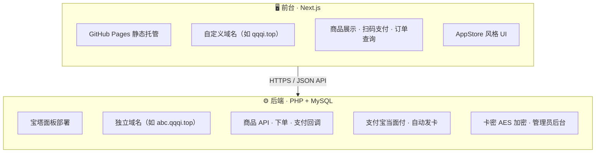

# 甜甜发卡 · 虚拟商品自动发卡系统

> 支付宝当面付 · 自动秒发 · 前台 GitHub Pages + 后端宝塔面板

---

## ✨ 功能特性

### 前台
- **AppStore 风格 UI**：纯白背景，电脑端卡片网格 / 手机端横向列表
- **商品分类筛选**：横向滚动胶囊按钮，支持多级分类
- **商品卡片**：热门/置顶标记、分类标签、商品描述、划线原价、实时库存
- **支付宝当面付**：扫码支付，支付成功后自动秒发卡密
- **订单查询**：手机号 + 图形验证码，支持查看订单详情和卡密
- **微信拦截**：微信内打开强制提示去浏览器打开（无关闭按钮）
- **辅助页面**：常见问题 FAQ、售后反馈
- **响应式设计**：手机 / 平板 / 电脑自适应

### 后台
- **仪表盘**：今日订单、今日营收、累计订单、剩余卡密、最近订单
- **分类管理**：多级分类、排序、启用/禁用
- **商品管理**：多规格独立定价、上下架、热门/置顶、商品描述/购买须知/使用教程
- **卡密管理**：TXT 批量导入、一卡一售、AES-256 加密存储、库存统计
- **订单管理**：全维度筛选、补发卡、取消订单
- **售后管理**、**FAQ 管理**
- **网站设置**：站点信息、支付超时、限购数量、库存预警、IP 防刷

---

## 🏗️ 系统架构

```



```

| 目录 | 说明 |
| --- | --- |
| `web/` | 前台：Next.js（App Router），静态导出部署 GitHub Pages |
| `server/` | 后端：PHP + MySQL，含支付宝签名、卡密加密、自动发卡、管理后台 |
| `.github/workflows/deploy.yml` | GitHub Actions 自动构建并部署前台 |

---

## 🚀 快速开始

### 1. 前台部署（GitHub Pages + 自定义域名）

1. 仓库 **Settings → Pages → Source** 选择 **GitHub Actions**
2. **Settings → Pages → Custom domain** 填写你的域名
3. 在 DNS 服务商配置 CNAME 记录指向 GitHub Pages
4. 推送代码到 `main` 分支，Actions 自动构建发布
5. 访问你的自定义域名

> 构建环境变量：`NEXT_PUBLIC_API_BASE`（后端 API 地址）、`NEXT_PUBLIC_BASE_PATH`（自定义域名留空）

### 2. 后端部署（宝塔面板）

1. 上传 `server/` 下所有文件到站点根目录
2. 宝塔创建 MySQL 数据库，执行 `server/sql/install.sql` 导入表结构
3. 复制 `config.example.php` 为 `config.php`，填写：
   - 数据库连接信息
   - 支付宝 APPID / 应用私钥 / 支付宝公钥
   - 卡密 AES 加密密钥（自行生成随机值）
   - `ALLOW_ORIGIN` 填写前台域名（不带末尾斜杠）
4. 确保 PHP 已开启扩展：`openssl`、`curl`、`pdo_mysql`
5. 站点配置 HTTPS（支付宝回调必须 HTTPS）
6. 支付宝开放平台申请「当面付」，生成 RSA2 密钥，**应用公钥必须上传到支付宝平台**

---

## 🔗 常用地址

| 用途 | 地址示例 |
| --- | --- |
| 前台首页 | `https://你的前台域名/` |
| 订单查询 | `https://你的前台域名/query` |
| 后台管理 | `https://你的后端域名/admin/login.php` |
| 后端 API | `https://你的后端域名/api/` |
| 支付回调 | `https://你的后端域名/api/alipay_notify.php` |

---

## 🔒 安全提醒

- `config.php` 含数据库密码和支付宝密钥，**切勿**提交到公开仓库
- 后台管理员密码请妥善保管，定期修改
- 卡密采用 AES-256-CBC 加密存储，密钥在 `config.php` 中配置
- 前台为公开仓库，所有敏感配置只放在后端
- 部署后建议删除测试文件和工具脚本

---

## 🛠️ 技术栈

- **前台**：Next.js 16 + React 19 + TypeScript，静态导出
- **后端**：PHP 7.4+ / PDO / MySQL
- **支付**：支付宝当面付（RSA2 签名）
- **部署**：GitHub Pages（前台）+ 宝塔面板（后端）
- **设计**：AppStore 风格，全站 SVG 图标，无 emoji

---

## 📝 更新日志

### v2.0
- 全面重写 UI 为 AppStore 风格
- 新增分类管理、多规格商品、卡密加密存储
- 新增订单查询、FAQ、售后页面
- 微信内打开强制提示去浏览器
- 后台仪表盘、商品/卡密/订单管理完善
